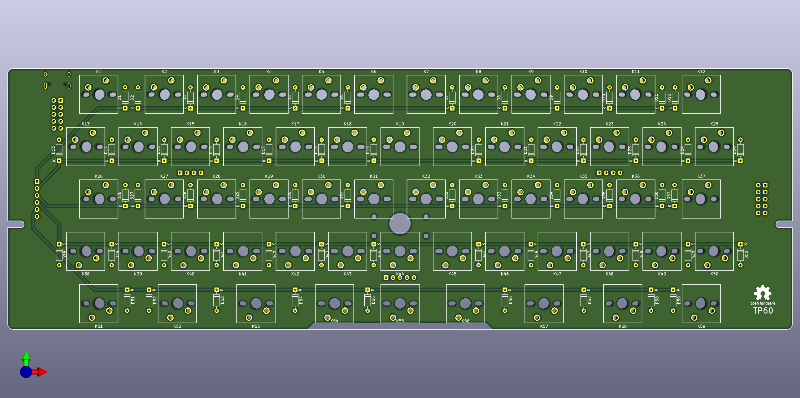
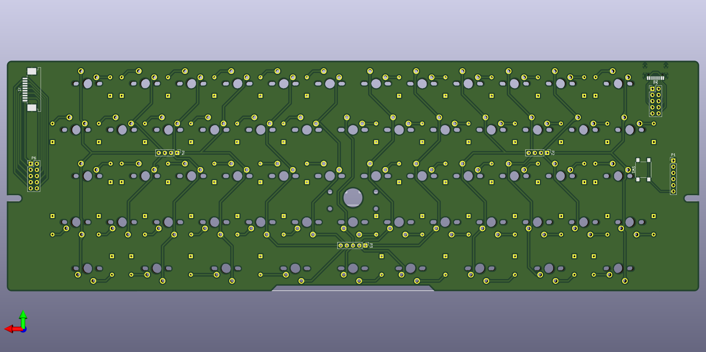

# TP60

Custom PCB for gh60-like keyboard with trackpoint. Teensy 2.0 as main Controller.

Also see:

https://github.com/gzeronet/teensy-trackpoint-tmk-keyboard/

## PCB View

### Front

{ width="800"}

### Back

{ width="800"}